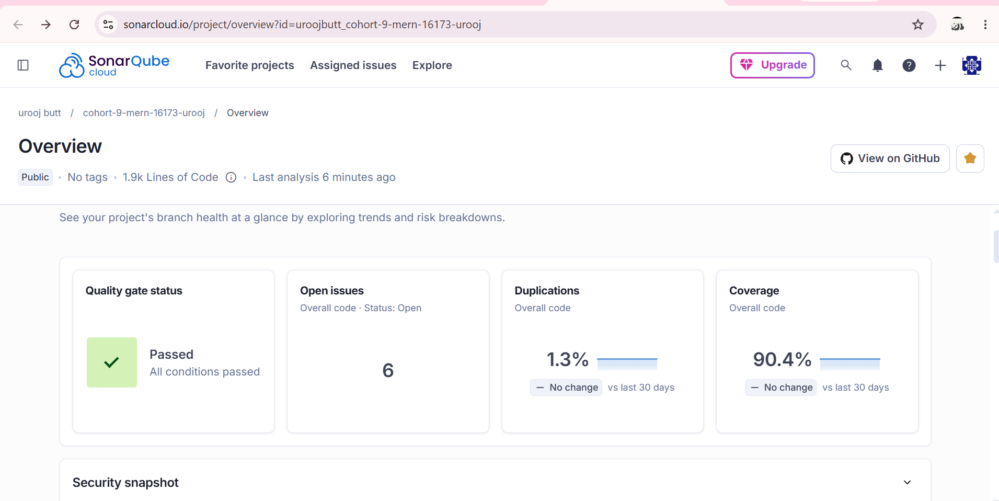
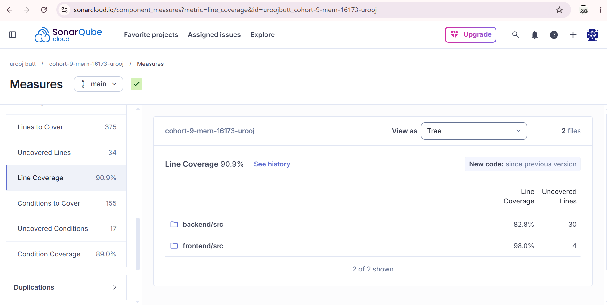
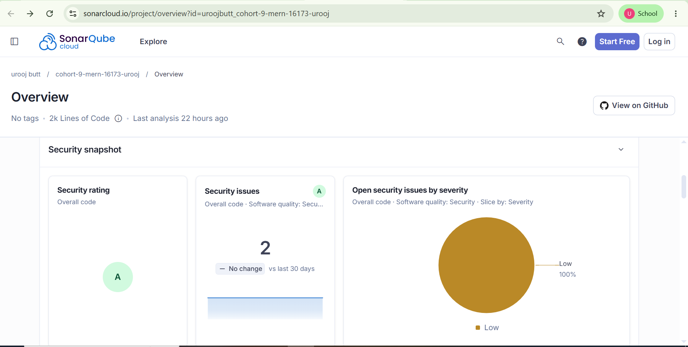
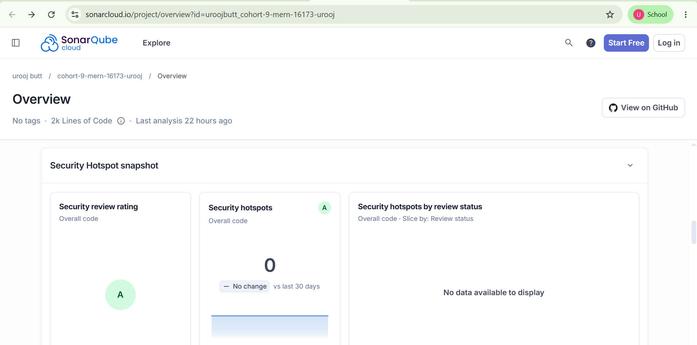
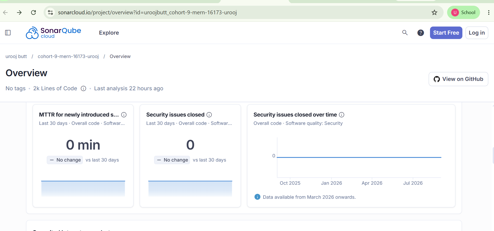
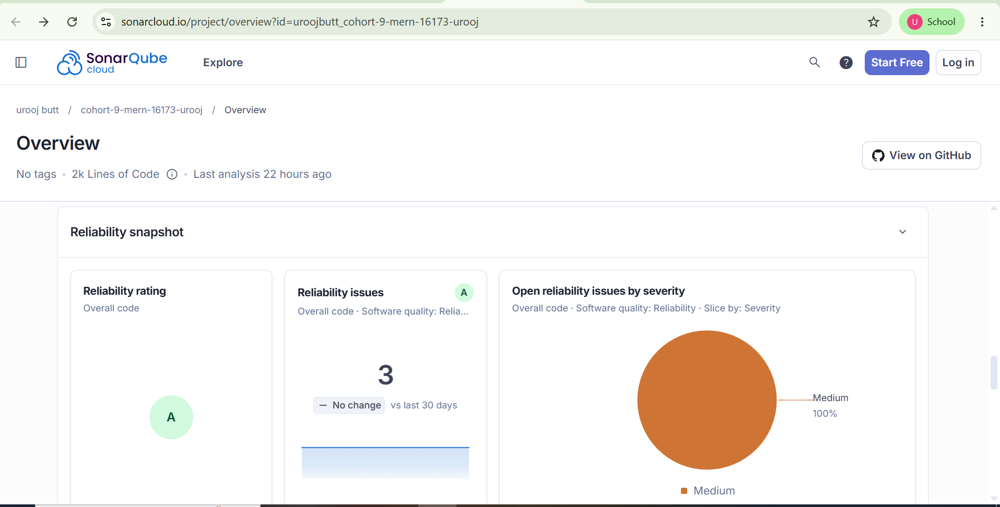
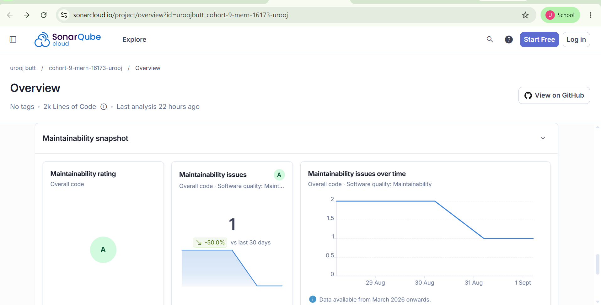

# Notesify — MERN Rich-Text Notes Application

Notesify is a full-stack notes management application built with NestJS on the backend and React 19 + Vite on the frontend. It supports JWT authentication, rich-text note editing, and bulk import/export of user notes. The project was built as part of the 10Pearls Shine Program internship (Cohort 9, MERN domain).

---

## Table of Contents

- [Features](#features)
- [Tech Stack](#tech-stack)
- [Architecture](#architecture)
- [Project Structure](#project-structure)
- [Getting Started](#getting-started)
- [API Endpoints](#api-endpoints)
- [Testing](#testing)
- [Git Workflow](#git-workflow)
- [Code Quality — SonarQube Report](#code-quality--sonarqube-report)
- [Future Improvements](#future-improvements)
- [Author](#author)

---

## Features

### Authentication & Authorization
- User signup and login with password hashing via `bcrypt`.
- JWT-based authentication using `passport-jwt`, issued on login and required for all protected routes.
- Route protection on the backend via a custom `JwtAuthGuard` and typed `AuthenticatedRequest`.
- Route protection on the frontend via a `ProtectedRoute` component that checks `isAuthenticated` and `isLoading` state.
- Auth state managed globally through a React `AuthContext` exposing a `useAuth()` hook with `login()` and `logout()` functions.
- Axios instance (`api.js`) with a JWT request interceptor to attach tokens, and a 401 response interceptor that clears local storage and redirects to login.

### Rich Text Editor
- Built with Tiptap (`StarterKit` + `Placeholder`) for full formatting support: headings, bold/italic, lists, and more.
- Custom toolbar (`NoteEditorToolbar.jsx`) with correct active-state highlighting, solved using `useReducer` combined with Tiptap's `onTransaction` callback, since the editor instance is a mutable object outside React's normal state/re-render cycle.
- Shared `/notes/new` and `/notes/:id/edit` routes both render `NoteEditor`, switching between create and edit mode via `useParams()`.
- `@tailwindcss/typography` plugin integrated (Tailwind v4 `@plugin` syntax) for correctly styled headings and lists inside rendered notes.

### Notes CRUD
- Full create, read, update, and delete flow for notes, scoped to the authenticated user (ownership enforced at the service layer).
- Notes schema includes title, content, `userId`, and timestamps.
- DTO validation using `class-validator`, including non-empty title checks (`@Matches(/\S/)`) and a content length cap (`@MaxLength(50000)`).
- Optimistic delete on the dashboard, with an error state and retry option instead of silently falling back to dummy data.

### Import / Export
- `GET /notes/export` downloads all of a user's notes as a structured JSON file.
- `POST /notes/import` bulk-imports notes from an uploaded JSON/TXT file, with duplicate checking and schema validation via `ImportNoteDto`.
- The export route is intentionally declared before the `:id` route to avoid NestJS routing conflicts.
- Frontend `ExportButton.jsx` and `ImportButton.jsx` components, integrated into the dashboard toolbar; the export button is disabled when there are no notes to export.
- Both buttons include `aria-label` attributes for accessibility.
- Export currently downloads all notes in a single file with no per-note selection (see Future Improvements).

### Logging & Security
- Structured server-side logging via `pino-http` / `nestjs-pino`, with a custom request serializer limited to method, URL, and status code.
- Security headers applied via Helmet.
- Global `ValidationPipe` with `whitelist: true` and `forbidNonWhitelisted: true`, so unrecognized payload fields are rejected with a validation error rather than silently stripped.
- MongoDB connection managed through `@nestjs/mongoose` and `ConfigService`, with an optional custom DNS resolver gated behind a `USE_CUSTOM_DNS` environment flag.

### Responsive Design
- Layouts adapt across screen sizes using Tailwind's responsive breakpoint prefixes (e.g. `sm:`), rather than fixed desktop-only sizing.
- `min-h-screen` used in place of `overflow-hidden` so content is not clipped on smaller viewports.
- Auth forms, dashboard, and the note editor toolbar are built to remain usable on both mobile and desktop widths.

### Accessibility & UI Details
- `role="status"` on the loading spinner and `aria-label` on the search input for screen reader support.
- Yellow/black themed UI (marigold `#F4C430` on ink black `#121212`), centered auth forms, and a dot-grid background, with `lucide-react` icons throughout.

---

## Tech Stack

### Backend
- **Framework**: NestJS (v11) with TypeScript
- **Database**: MongoDB (Atlas), via Mongoose ODM (`@nestjs/mongoose`)
- **Authentication**: Passport.js with `passport-jwt`, `JwtModule.registerAsync()` and `ConfigService` for fail-fast `JWT_SECRET` validation
- **Password Security**: `bcrypt` for hashing
- **Validation**: `class-validator` and `class-transformer` for DTO validation and payload transformation
- **Logging**: `pino-http` / `nestjs-pino` with a custom, minimal request serializer
- **Security**: Helmet for HTTP security headers
- **Module structure**: separate `auth`, `users`, and `notes` modules, each with their own DTOs, schemas, services, and controllers

### Frontend
- **Framework**: React 19 with Vite as the build tool
- **Styling**: Tailwind CSS v4, using the `@theme` and `@plugin` syntax for custom font tokens and the typography plugin
- **Animation**: Framer Motion
- **Rich Text**: Tiptap editor with `StarterKit` and `Placeholder` extensions
- **HTTP Client**: Axios, with a centralized instance and request/response interceptors for auth handling
- **Icons**: `lucide-react`
- **State Management**: React Context API (`AuthContext`) for authentication state; local component state elsewhere
- **Routing**: Route-based structure with protected routes for authenticated pages

### Testing
- **Backend**: Mocha, Chai, and Sinon, with coverage reports generated by `nyc`
- **Frontend**: Jest and React Testing Library

### Code Quality
- SonarQube / SonarCloud static analysis, run via a manual local scan (`@sonar/scan`), since Automatic Analysis did not support the monorepo structure
- CodeRabbit for automated pull request review

---

## Architecture

Notesify follows a monorepo layout with a clearly separated backend and frontend, communicating over a REST API.

- **Backend (NestJS)** follows Nest's modular architecture: each domain area (`auth`, `users`, `notes`) is its own module with its own controller, service, DTOs, and schema. Controllers stay thin and delegate business logic to services; services handle data access and enforce rules such as scoping notes to the authenticated user. Authentication is implemented as a Passport strategy (`JwtStrategy`) combined with a reusable `JwtAuthGuard`, so any route can be protected by simply attaching the guard.
- **Frontend (React)** is organized by responsibility: `api/` holds the Axios configuration and interceptors, `context/` holds global state (authentication), `components/` holds reusable UI pieces (including route guards, buttons, and the editor toolbar), and `pages/` holds the top-level views (Dashboard, Editor, Auth screens).
- **Data flow**: the frontend calls the NestJS REST API under `/api`, attaching a JWT on every request. The backend validates the token, resolves the current user, and scopes all note operations to that user before touching MongoDB through Mongoose models.
- **Cross-cutting concerns** — logging, validation, and security headers — are applied globally in the NestJS application rather than per-route, keeping individual controllers focused on business logic.

---

## Project Structure

```text
cohort-9-mern-16173-urooj/
├── backend/                  # NestJS backend
│   ├── src/
│   │   ├── auth/             # Authentication module & guards
│   │   ├── notes/            # Notes CRUD, import/export logic & DTOs
│   │   └── users/            # User management
│   └── test/                 # Mocha test setup & helper files
└── frontend/                 # React 19 application
    └── src/
        ├── api/               # Axios configuration & auth interceptors
        ├── components/        # UI components & route protection
        ├── context/           # State management (AuthContext)
        └── pages/             # Dashboard, Editor, Auth views
```

---

## Getting Started

### Prerequisites
- Node.js (v20+)
- MongoDB (local or Atlas)

### 1. Backend Setup

```bash
cd backend
npm install
```

Create a `.env` file in `backend/`:

```env
PORT=3000
MONGO_URI=your_mongodb_uri
JWT_SECRET=your_jwt_secret
FRONTEND_URL=http://localhost:5173
USE_CUSTOM_DNS=false
```

Start dev server:

```bash
npm run start:dev
```

Run tests and coverage:

```bash
npm run test
npm run test:cov
```

### 2. Frontend Setup

```bash
cd frontend
npm install
```

Create a `.env` file in `frontend/` (optional, defaults to `http://localhost:3000/api`):

```env
VITE_API_URL=http://localhost:3000/api
```

Start dev server:

```bash
npm run dev
```

Run frontend tests:

```bash
npm run test
```

---

## API Endpoints

All endpoints below are prefixed with `/api`.

| Method | Endpoint | Description | Auth Required |
| --- | --- | --- | --- |
| `POST` | `/auth/signup` | Register new user | No |
| `POST` | `/auth/login` | Authenticate & receive JWT | No |
| `GET` | `/notes` | Fetch all user notes | Yes |
| `POST` | `/notes` | Create a note | Yes |
| `GET` | `/notes/:id` | Get single note by ID | Yes |
| `PUT` | `/notes/:id` | Update note | Yes |
| `DELETE` | `/notes/:id` | Delete note | Yes |
| `GET` | `/notes/export` | Download notes as JSON | Yes |
| `POST` | `/notes/import` | Import notes from file upload | Yes |

---

## Testing

The project uses a dual-testing setup on the backend and a single framework on the frontend, with combined coverage tracked through SonarQube.

### Backend (Mocha, Chai, Sinon)
- All backend spec files were migrated from Jest to Mocha/Chai, following the naming convention `*.mocha.spec.ts` for Mocha files (with the original Jest `*.spec.ts` files removed once migration was confirmed).
- 6 spec files fully migrated and passing: `AppController`, `AuthController`, `AuthService`, `NotesController`, `NotesService`, `UsersService`.
- 18 backend tests passing in total.
- Conversion patterns used during migration: `jest.fn()` → `sinon.stub()`, `.mockResolvedValue()` → `.resolves()`, `toBeDefined()` → `to.exist`, `rejects.toThrow()` → manual `try/catch` with `expect(err).to.be.instanceOf(...)`, and `afterEach(() => sinon.restore())` added to every spec file.
- `.mocharc.json` is configured with `ts-node/register` and a glob matching `*.mocha.spec.ts`; `test/mocha-setup.ts` registers `sinon-chai` globally.
- E2E testing is planned for a future iteration and is not yet implemented.

### Frontend (Jest, React Testing Library)
- 78 tests passing across 5 suites: `NoteEditorToolbar`, `Dashboard`, `NoteEditor`, `Login`, `SignUp`.
- 96.57% statement coverage.
- Covers route guards, page behaviors, form validation, and editor state transitions.

### Combined
- 96 passing tests across backend and frontend.
- Coverage reports (`lcov.info`) from both backend and frontend are fed into SonarQube for a unified quality view.

---

## Git Workflow

```
Fetch Upstream
    ↓
Checkout Develop
    ↓
Merge Upstream/Develop
    ↓
Push to Origin
    ↓
Create Feature Branch
    ↓
Make Changes & Commit
    ↓
Push Branch to Origin
    ↓
Open Pull Request
    ↓
CodeRabbit Review
    ↓
Fix Review Comments
    ↓
Mentor Review
    ↓
Merge to Develop
```

- **Branch naming**: feature branches follow a `feature/<area>/<description>` convention, e.g. `feature/backend/import-export`, `feature/frontend/authentication`.
- **Sequential/dependent branching**: rather than always branching from `develop`, each new branch is created from the most recent local branch when the previous branch's PR has not yet merged (e.g. `feature/backend/mocha-chai-testing` was branched from `feature/backend/import-export`, and `feature/frontend/notes-integration` was branched from the auth module branch). Once the prior branch's PR merges into `develop`, the dependent branch is rebased directly onto `develop`.
- **Rebase pattern**: checkout `develop`, pull latest, checkout the feature branch, then `git rebase develop` — rebasing onto `develop` directly rather than onto the now-merged parent branch.
- **PR scoping**: pull requests are kept to roughly 15–20 files or fewer, with descriptions that match the actual code changes and avoid comments that simply restate the code.
- **Code review with CodeRabbit**:
  - `@coderabbitai review` is run after each round of fix commits.
  - Inline comment threads are replied to directly (not as top-level comments), referencing the commit hash that addresses them, then marked resolved.
  - Flags that are out of scope for the current PR are acknowledged with a brief reply explaining they will be addressed in a relevant future branch.
  - Trivial assertions (e.g., a bare "should be defined" test) are avoided in favor of meaningful checks.
- **Quality gate before merge**: SonarQube/SonarCloud analysis and the Quality Gate are checked as part of the review process, alongside standard CodeRabbit review.

---

## Code Quality — SonarQube Report

Static analysis is run via SonarCloud, using a manual local scan (`@sonar/scan`) rather than Automatic Analysis, since the monorepo structure was not supported by automatic scanning. Sources are configured for both `frontend/src` and `backend/src`, with test files and `node_modules` excluded.

The project passed its SonarQube Quality Gate, with Security, Reliability, Maintainability, and Security Review ratings of A.




<details>
<summary><b>View Detailed Metrics Screenshots (Security, Reliability, Maintainability)</b></summary>

### Security & Review




### Reliability & Maintainability



</details>

---

## Future Improvements

- Add a global exception handling middleware/filter on the backend for consistent error responses.
- Add per-note selection for export, instead of only exporting all notes at once.
- Add HTML sanitization for Tiptap's rich-text output to mitigate potential XSS risk on rendered note content.
- Implement backend E2E test coverage in addition to existing unit tests.
- Continue improving SonarQube coverage percentage and reducing open reliability/maintainability issues.
- Expand import support to additional file formats beyond JSON/TXT.

---

## Author

**Urooj Butt**
